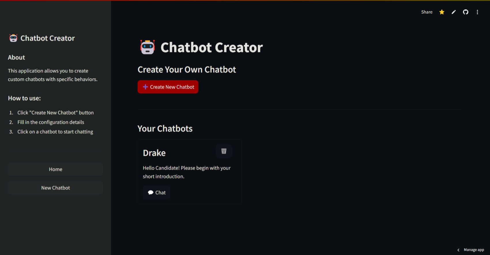
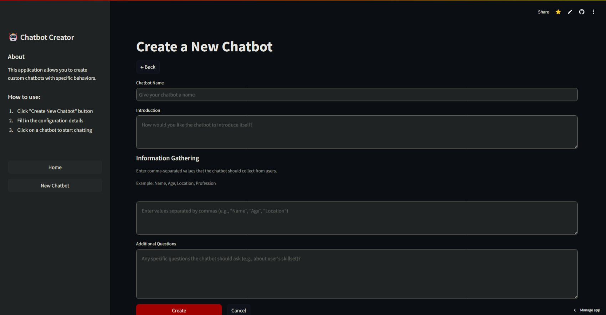
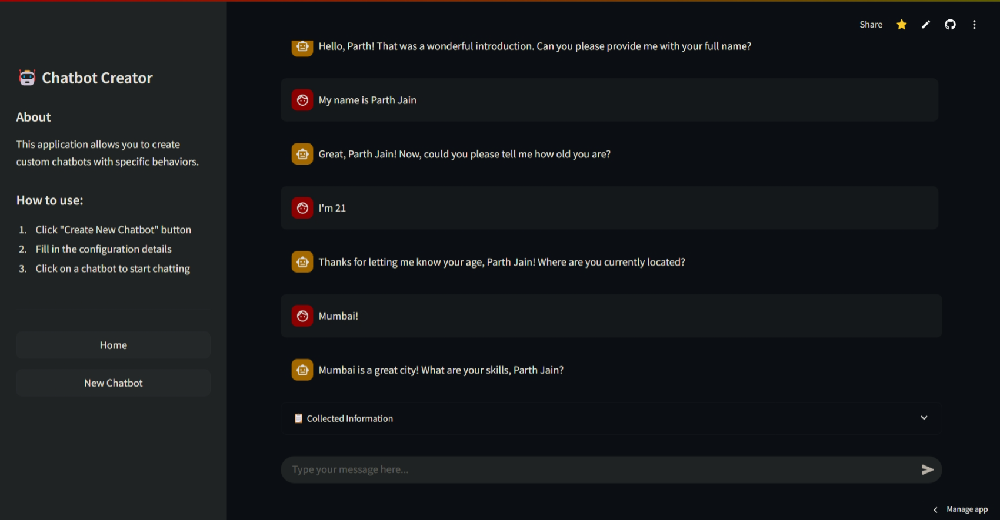

# Custom Chatbot Creation Tool

## Project Overview

This tool allows users to create custom AI-powered chatbots designed for specific information gathering needs. The platform enables the creation of specialized chatbots that can handle various requirements, such as gathering information or handling additional questions.

Key capabilities:
- Create chatbots with predefined information gathering objectives
- Customize conversation flows based on specific requirements
- Handle technical and non-technical interactions
- Deploy user-friendly interfaces for both creators and end-users

## Screenshots







## Installation Instructions

### Setup Steps

1. Clone the repository:
   ```
   git clone https://github.com/ParthJain18/custom-chatbot-creator.git
   cd custom-chatbot-creator
   ```

2. Create and activate a virtual environment (recommended):
   ```
   python -m venv venv
   
   # On Windows
   venv\Scripts\activate
   
   # On macOS/Linux
   source venv/bin/activate
   ```

3. Install required dependencies:
   ```
   pip install -r requirements.txt
   ```

4. Set up environment variables:
   Create a `.env` file in the root directory with the following:
   ```
   GROQ_API_KEY=your_api_key_here
   ```

5. Launch the application:
   ```
   streamlit run app.py
   ```

## Usage Guide

### Creating a New Chatbot

1. Access the main dashboard and select "Create New Chatbot"
2. Define your chatbot's purpose and information gathering objectives
3. Add any additional data that you want to collect
4. Test your chatbot in the sandbox environment

## Technical Details

### Libraries and Technologies
- **Streamlit**: Frontend interface and deployment
- **Groq API**: Powers the large language model
- **JSON**: Data storage options

### Architecture
The application follows a modular design with these components:
- **Interface Layer**: Streamlit-powered UI for chatbot creation and interaction
- **Logic Layer**: Python modules for processing inputs, managing context, and handling conversation flow
- **AI Integration**: Connection to language models via GroqAI API
- **Storage Layer**: Data persistence for chatbot configurations and conversation logs

### Model Details
The system primarily leverages Meta's Llama 3.3 70b models.

## Prompt Design

### System prompts:

```
You are {chatbot.name}. Your job is to collect data from the user regarding the given topics below in a natural way. You may infer some information from the user's chat or ask for the information directly.
Information to gather: {chatbot.info_gathering_prompts}
```

```
For your response, you must follow this json schema (The data fields would depend on the information you are collecting):
And message would be passed as a response to the user.
{{
    "message": "Hello, Parth! That was a wonderful introduction. Can you please provide me with your skillsets as well?",
    "data": {{
        "name": "Parth Jain",
        "age": 21,
        "location": "Mumbai",
        "profession": "Software Engineer"
    }}
}}

Additionally, if you are done gathering all the required information, you may ask the user questions regarding: {chatbot.additional_questions}
```

### Response schema:

```python
class chatResponse(BaseModel):
    message: str
    data: Dict[str, Any]
```


## Challenges & Solutions

### Challenge 1: Context Management
**Problem**: Maintaining conversation context across multiple turns while keeping within token limits.
**Solution**: Implemented temporary system prompts to reduce token count for the message history.

### Challenge 2: Consistency in Information Collection
**Problem**: Ensuring all necessary information is collected even when conversations take unexpected turns.
**Solution**: Created a state management system that tracks collection progress and can gracefully redirect conversations.

## Future Work

The following features are planned for future releases:

### User Management
- User authentication and authorization
- Role-based permissions for teams
- Sharing chatbots between users or public

### Model Selection
- Support for multiple LLM providers
- Ability to choose different models based on use case
- Fine-tuning options for domain-specific applications

### Advanced Features
- Analytics dashboard for chatbot performance
- Export of collected data to various formats
- Integration with external data sources
- API endpoints for embedding chatbots in other applications


## Contributing

Contributions to improve the chatbot creation tool are welcome! Please feel free to submit a pull request or open an issue to discuss potential changes.
